

# Monitoring Supply Voltage using HLVD

# Introduction
Many of the PIC microcontrollers have a High/Low-Voltage Detect (HLVD) module that can be used to monitor the device voltage (VDD) and indicate the user if voltage has decreased below a specified voltage or increased above a specified voltage.  This is a programmable circuit that sets a device voltage trip point and the direction of change from that point (positive going, negative going or both).  This feature is useful in battery monitoring applications.
This example demonstrates using an HLVD module to quickly detect when the supply voltage of the microcontroller has decreased below the specified trip point or increased above the specified trip point.

# Related Documents / Useful Links

- [TB3237 - Getting Started with HLVD Technical Brief](https://www.microchip.com/DS90003237)
- [PIC18-Q10 Product Family Page](https://www.microchip.com/design-centers/8-bit/pic-mcus/device-selection/pic18f-q10-product-family)
- [PIC18F47Q10 Data Sheet](http://www.microchip.com/DS40002043)
- [PIC18F47Q10 Code Examples on GitHub](https://github.com/microchip-pic-avr-examples?q=pic18f47q10)

# HLVD

The HLVD is a necessary power supply monitoring feature in numerous battery powered applications, where the supply voltage of a microcontroller could fall below the specified threshold level and require battery replacement or recharging for uninterrupted operation of the microcontroller.  The HLVD feature is capable of monitoring supply voltage of a microcontroller which is directly powered from a battery power source. The HLVD based voltage monitoring circuitry has several advantages over an ADC based voltage monitoring circuit. When the HLVD module is enabled, a comparator within HLVD uses an internally generated voltage reference as the set point. The set point is compared with the trip point. The “trip point” voltage is the voltage level at which the device detects a high or low voltage event, depending on the configuration of the HLVD module. When the supply voltage is equal to the trip point, the comparator generates an interrupt signal by setting the HLVDIF bit. The trip point voltage is software programmable to any of 16 values as shown in the below Table 1. The trip point is selected by programming the SEL bits.

			Table 1:HLVD Trip point Voltages

***Note: Refer the device datasheet for the typical Trip Point Voltage (V) settings. And refer MCC configuration GUI of HLVD peripheral for minimum and maximum Trip Point Voltage (V) settings.***

# Demo Description

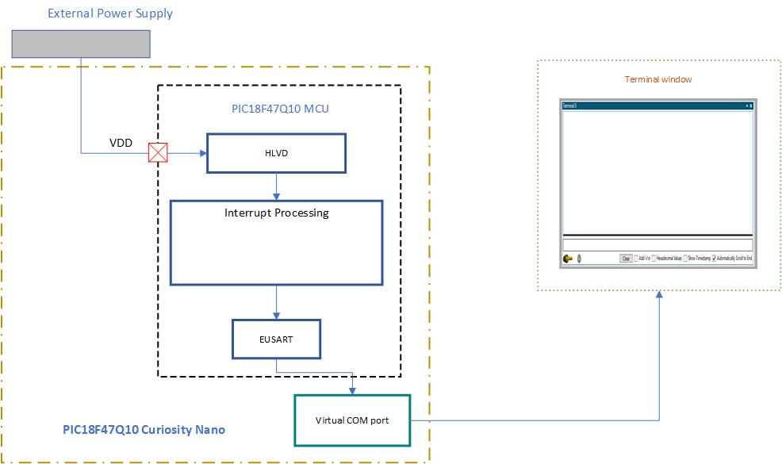

		Figure 1: Block diagram of application demo

* PIC18F47Q10 Curiosity Nano board and external power supply are used to demonstrate the configuration and usage of the HLVD module. HLVD is used to monitor the microcontroller supply voltage for low and high voltage detect.
* After power up the trip-point voltage of HLVD is configures to 3.15V to detect low supply voltage.    
* If the supply voltage is decreased below the setpoint the HLVD module generates interrupt. EUSART is used to send messages   to the terminal window that low voltage is detected.
* Once the low voltage is detected the trip point is changed to 4.35V to detect high supply voltage using HLVD.
* If the supply voltage is increased, above the setpoint the HLVD module generates interrupt. EUSART is used to send a message to the terminal that high voltage is detected.
* After detection of the high supply voltage, the set point is changed back to 3.15V to detect low supply voltage. The process is repeated.

# Hardware used
* [PIC18F47Q10 Curiosity nano evaluation board](https://www.microchip.com/Developmenttools/ProductDetails/DM182029)

With full program and debug capabilities, the PIC18F47Q10 Curiosity Nano evaluation kit offers complete support for the new design. With the award-winning MPLAB X integrated development platform and MPLAB Code Configurator (MCC), the kit provides access to the Intelligent analog and Core Independent Peripherals on the PIC18F47Q10. Figure 2 shows the PIC18F47Q10 Curiosity Nano board.

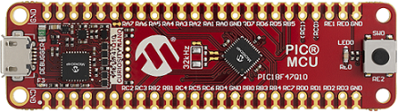

		Figure 2: PIC18F47Q10 Curiosity Nano board

# Software Tools:

Microchip’s free MPLAB X IDE, compiler and MPLAB Code Configurator (MCC) graphical code generator are used throughout the application firmware development to provide easy and hassle-free user experience. Following are the tool versions used for this demo application:

* [MPLAB® X IDE v5.45](https://www.microchip.com/mplab/mplab-x-ide)
* [XC8 Compiler v2.31](https://www.microchip.com/mplab/compilers)
* [MPLAB® Code Configurator (MCC) v4.1.0](https://www.microchip.com/mplab/mplab-code-configurator)
* [MPLAB® Code Configurator Library (CCL) v1.37.10](https://www.microchip.com/mplab/mplab-code-configurator)
* [MCC Device Libraries PIC10 / PIC12 / PIC16 / PIC18  MCUs v1.81.7](https://www.microchip.com/mplab/mplab-code-configurator)
* [Microchip PIC18F-Q Series Device Support 1.9.175](https://packs.download.microchip.com/)
* [Data Visualizer](https://www.microchip.com/en-us/development-tools-tools-and-software/embedded-software-center/mplab-data-visualizer)

***Note: For running the demo, the installed tool versions should be the same or later. This example is not tested with previous versions.***

## Data Visualizer:
Data Visualizer is a software tool used to process and visualize data. The Data Visualizer can receive data from various sources such as the Embedded Debugger Data Gateway Interface (DGI) and COM ports. Data Visualizer is made up of several modules such as Graph, Oscilloscope, Terminal, Power debugging, Custom dashboard etc. In this example, Standalone data visualizer tool is used to receive messages from the Curiosity Nano board. The terminal window is used to display the messages upon detection of low or high supply voltage using HLVD. For more details on the Data Visualizer tool refer to the [Data Visualizer user guide](https://www.microchip.com/DS40001903).

# Demo realization
## Peripherals Configuration using MCC
### System Configuration

Configure the system clock to 1 MHz by going to Project Resources → System → Clock Control. Select HFINTOSC for Clock Source, set the frequency to 1 MHz, and the clock divider to 1, as shown in Figure 3.
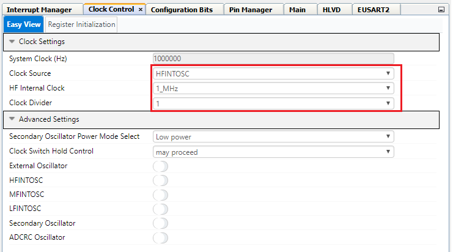

			Figure 3: Clock Control
Click on the Configuration Bits tab under Project Resources → System tab for changing the default configuration bit settings.

Select "WDT Operating Mode" from CONFIG3L register as "WDT Disabled" to disable the watchdog timer.

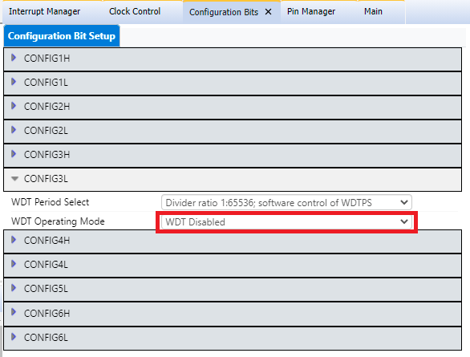

Figure 4: Configuration Bits

*  **Add peripherals to the project**

Add HLVD and EUSART2 peripherals to the project from Device Resources → Drivers.

			Figure 5: Peripherals

### HLVD Configuration

Configurations to be done for HLVD peripheral:
* Make sure that HLVD is enabled
* Set the Trip points as Min:3.00 Max:3.18
* Enable HLVD interrupt
* Enable Negative going Interrupt

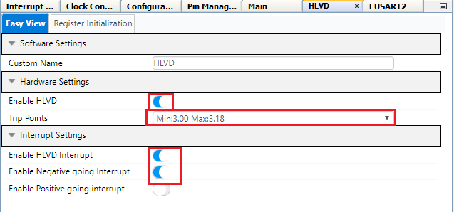

			Figure 6: HLVD Configuration

###         EUSART2 Configuration
In this demo, EUSART2 is used to transmit data on the terminal window upon detection of the low/high supply voltage using the HLVD module.
Configurations to be done for EUSART2 peripheral:
* Enable Redirect STDIO to USART by setting "Redirect STDIO to USART" slider button to ON state.
* Set baud rate as 9600.
* Disable Receive by setting "Receive Enable" slider button to OFF state.
* Enable Transmit.
* Make sure that EUSART2 is enabled from EUSART settings "Serial Port Enable".

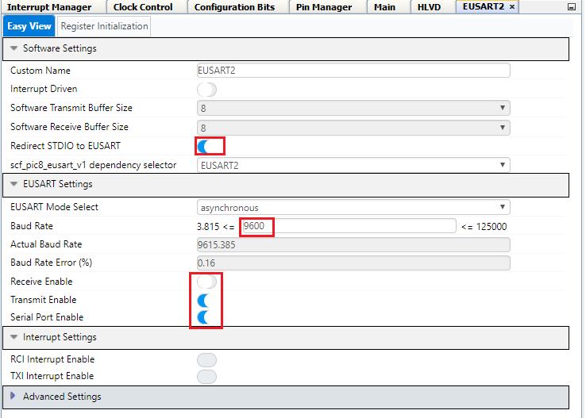

			Figure 7: EUSART 2 Configuration                                                                       

### Pin Configuration
The I/O pin mapping of the PIC18F47Q10 MCU for the EUSART2 interface and on-board LED is shown in the Figure 8.
Configurations to be done in the Pin Manager grid view window:
* Select pin RD0 as an EUSART2 TX2 pin.
* Pin RB7 for EUSART2 RX2 can be deselected.
* Configure Pin RE0 as output for connecting to LED0.

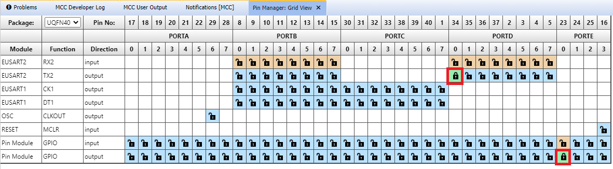

			Figure 8: Pin Manager grid view

Add custom name to the RE0 output pin as LED using Pin Manager. Check the Start High check box for LED pin RE0 for turning OFF the LED during initialization.

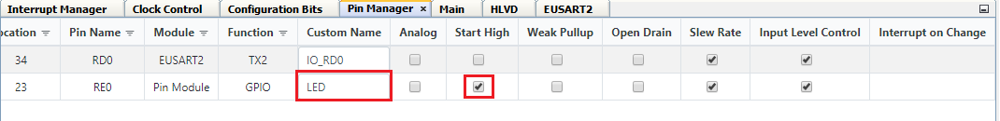

			Figure 9: Pin Manager
**Generate the Project files**
* Click the Generate button next to the project Resources to generate initializers and drivers for configured peripherals.

### Hardware Setup
 Follow the steps for Hardware setup:
1.	To power the PIC18F47Q10 device using external power supply the VOFF pin on the curiosity nano board should be connected to ground. Connect the pins VOFF pin to GND pin using the jumper.  Refer Figure 10 for VOFF pin.
2.	Connect external power supply to VTG and GND pins of the curiosity nano board to power the PIC18F47Q10 device using external power supply. Make sure external supply voltage is 3.3V. Refer Figure 10 for VTG pin.
3.	Setup the hardware, as shown in Figure 11.

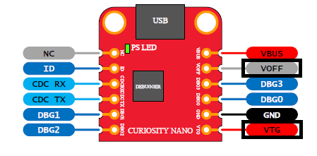

			Figure 10: VTG and VOFF pins

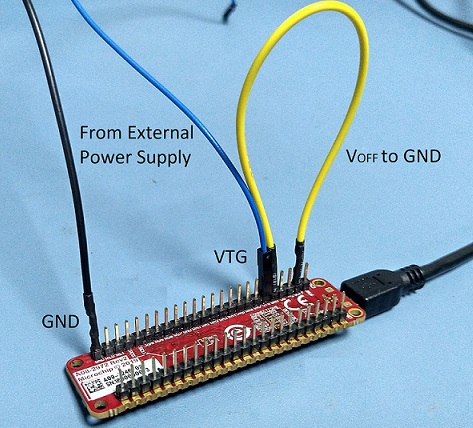

			Figure 11: Hardware setup

4.	Connect a micro USB cable from micro USB socket on the Curiosity nano board to the PC for programming the board and viewing the messages on the PC terminal window.

Open the Terminal window in Data Visualizer. Use 9600 baud rate. Any other terminal emulator can be used for this purpose.

 **Program the device**
* Program the microcontroller by clicking “Make and Program Device” icon on MPLAB X IDE as shown in below figure.

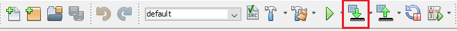

            Figure 12: Programming the device

# Demo Operation:
* Upon power on the trip-point of HLVD is set at 3.15V to detect low supply voltage.   
* A message will be displayed on the terminal window to lower the supply voltage for detecting low supply voltage event. Start decreasing the supply voltage.

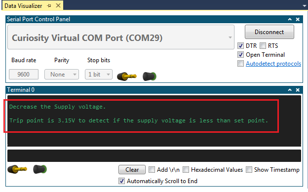

		Figure 13: Initial message on the terminal window

* If the supply voltage is decreased below the trip point i.e 3.15 V, the HLVD module generates interrupt. Observe the message on the terminal window that low voltage is detected.

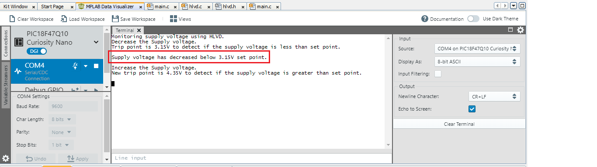

		Figure 14: Message after detecting low voltage

* Once the low voltage is detected the HLVD configuration is changed to detect high supply voltage. The trip point is changed to 4.35V and INTH bit of HLVDCON0 register is set.
* Start increasing the supply voltage.
* If the supply voltage is increased above the trip point i.e. 4.35V, the HLVD module generates interrupt. Observe the message on the terminal window that the high voltage is detected.

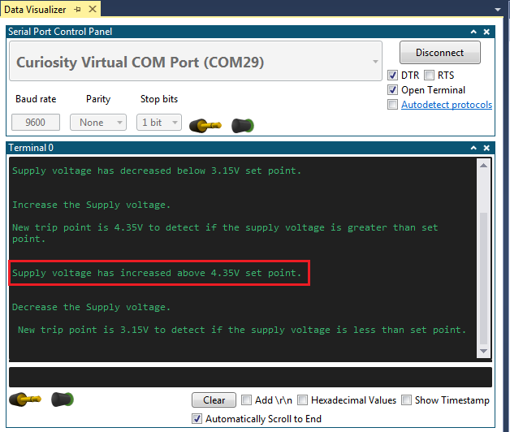

		Figure 15:  Message after detecting high voltage

* After detection of the high supply voltage, the trip point is changed back to 3.15V and INTL bit is set to detect low supply voltage. The process is repeated.

# Conclusion
High/Low-Voltage Detect (HLVD) module of a PIC microcontroller is a valuable feature for monitoring the supply voltage of a microcontroller that is directly battery powered. The usage of HLVD module doesn’t require any extra port pin for supply voltage monitoring.
